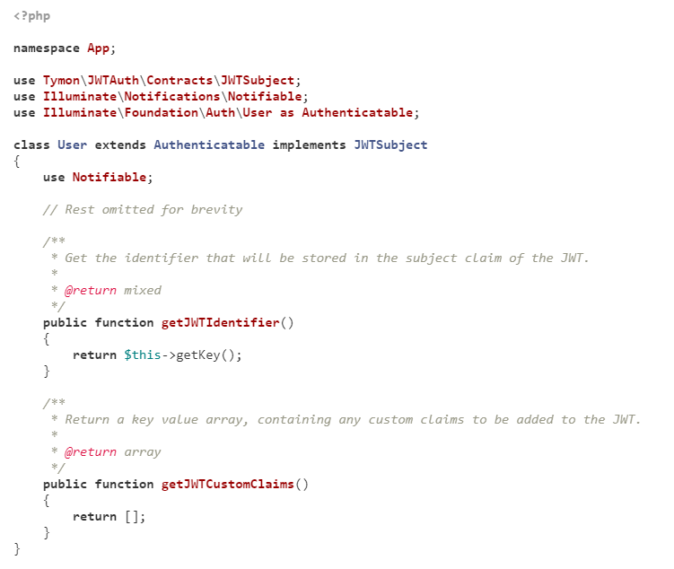
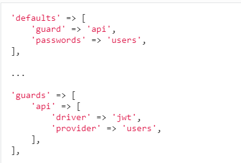
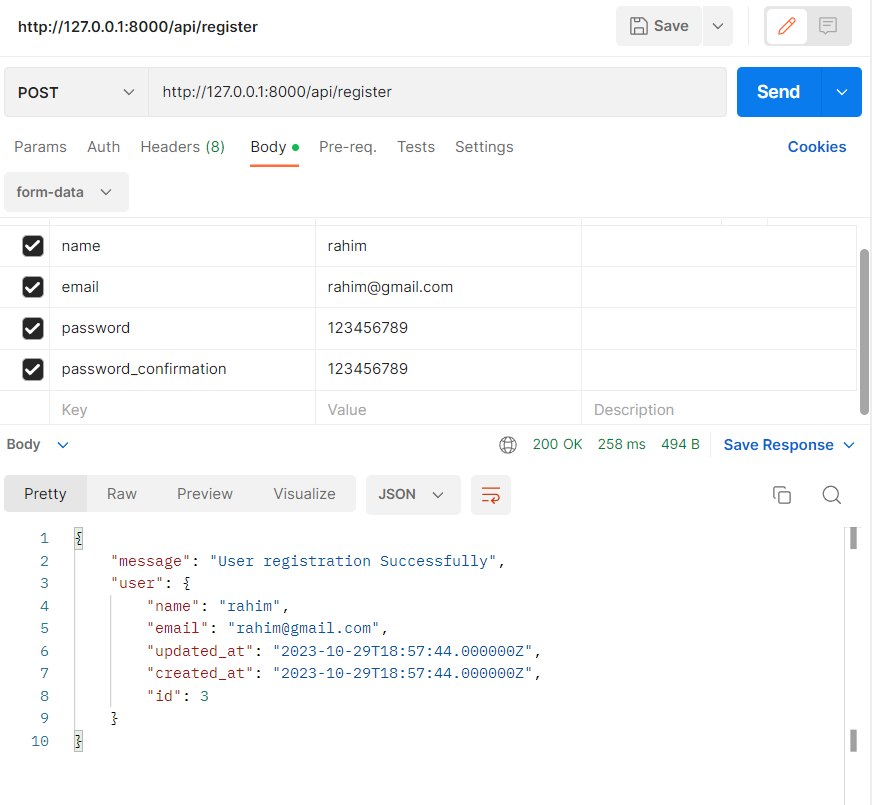
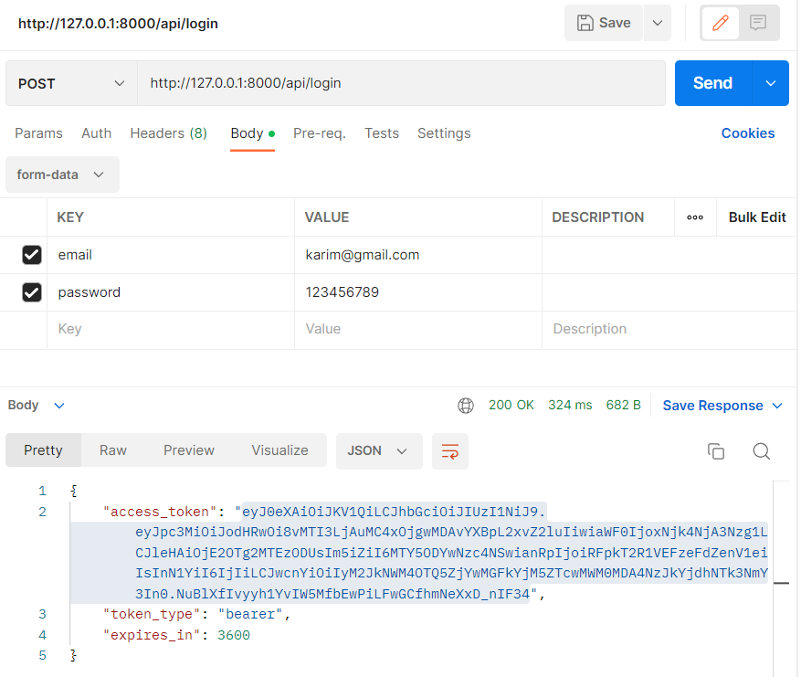
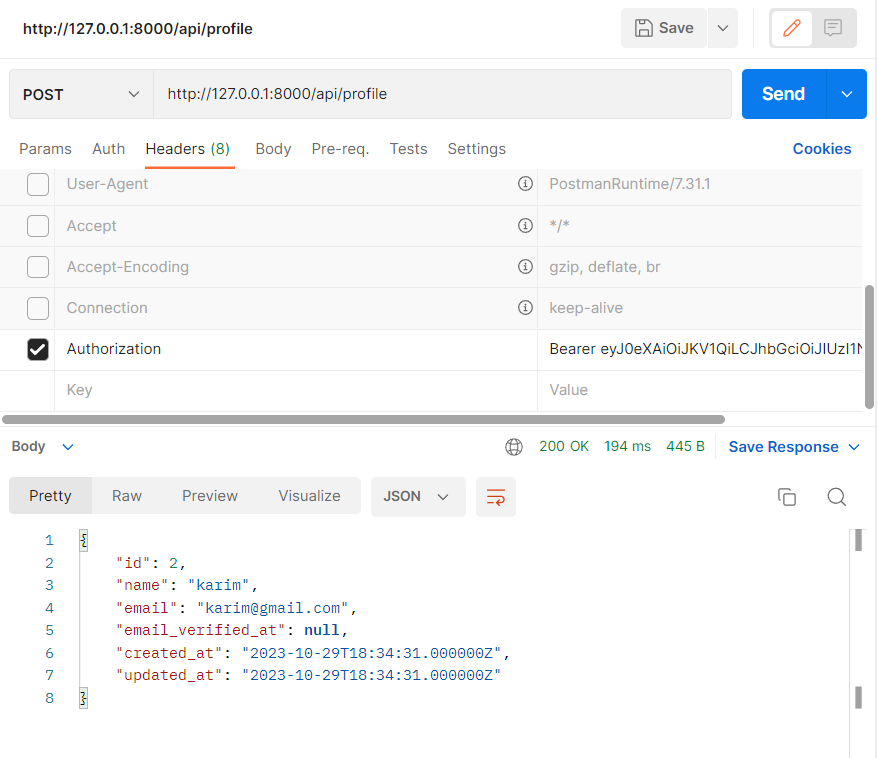
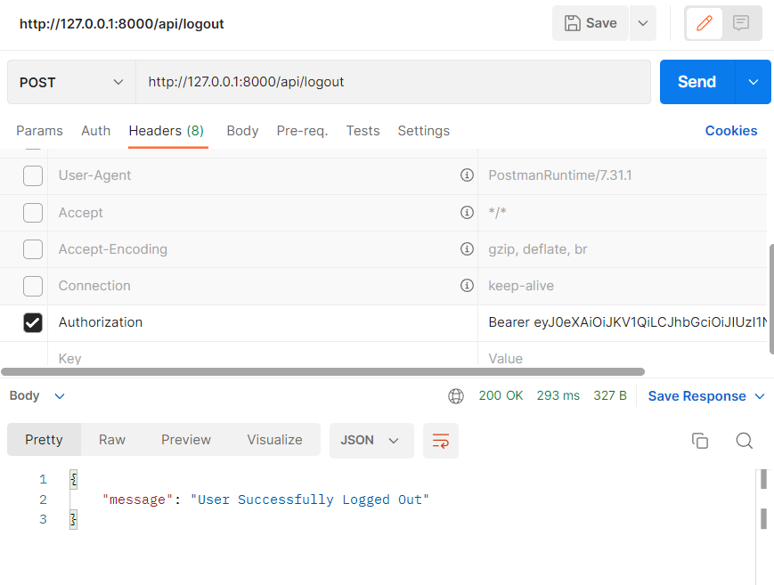

-----------Create Api with JWT-----------
1. User Register 
2. User Login
3. User Profile
4. User token refresh
5. User Logout

**JWT installation**

composer require tymon/jwt-auth

if you face any error, then run below command:
composer require tymon/jwt-auth --ignore-platform-reqs

Add the service provider to the providers array in the config/app.php config file as follows:
'providers' => [
    Tymon\JWTAuth\Providers\LaravelServiceProvider::class,
]

Run the following command to publish the package config file:
php artisan vendor:publish --provider="Tymon\JWTAuth\Providers\LaravelServiceProvider"

For generating jwt secret, simply type below command:
php artisan jwt:secret

**Update your User model**
Firstly you need to implement the Tymon\JWTAuth\Contracts\JWTSubject contract on your User model, which requires that you implement the 2 methods getJWTIdentifier() and getJWTCustomClaims().

The example below should give you an idea of how this could look. Obviously you should make any changes, as necessary, to suit your own needs.

**Configure Auth guard**
Note: This will only work if you are using Laravel 5.2 and above.

Inside the config/auth.php file you will need to make a few changes to configure Laravel to use the jwt guard to power your application authentication.

Make the following changes to the file:

Here we are telling the api guard to use the jwt driver, and we are setting the api guard as the default.

We can now use Laravel's built in Auth system, with jwt-auth doing the work behind the scenes!

**Create Controller**
php artisan make:controller UserController

User Register:

User Login:

User Profile:

User Logout:

